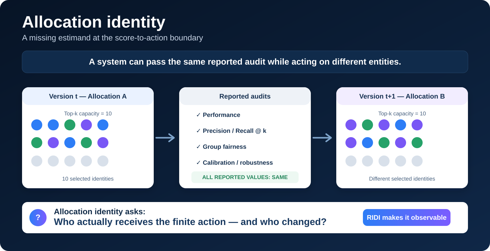

# RIDI

<div align="center">

## Allocation identity for capacity-limited AI

### A system can pass the same reported audit while acting on different entities

**RIDI is an open measurement and control toolkit for a missing estimand at the score-to-action boundary: _who receives finite action?_**

[](https://github.com/adeebnoor/ridi/actions/workflows/tests.yml)
[](https://www.python.org/)
[](LICENSE)
[](https://orcid.org/0000-0002-8251-1853)

[**Research site**](https://ridi-research-lab.onrender.com/) · [**Try the 60-second experiment**](https://ridi-research-lab.onrender.com/demo/) · [**Research docs**](https://ridi-research-lab.onrender.com/docs/) · [**Run in Colab**](https://colab.research.google.com/github/adeebnoor/ridi/blob/main/notebooks/RIDI_60_Second_Experiment.ipynb) · [**Audit your model**](#audit-your-own-scores)

</div>

---

[](https://ridi-research-lab.onrender.com/demo/)

## The missing estimand

AI systems are commonly evaluated by asking how accurately they predict, how well they rank, how calibrated they are, and how outcomes are distributed across groups. But many deployed systems ultimately do something more concrete: they turn scores into a **finite set of people, cases or items that receive action**.

That score-to-action boundary creates a separate scientific object:

> ## **Allocation identity: which entities receive the finite action?**

The associated manuscript shows that conventional aggregate audits need not identify this object. Performance and group-fairness summaries can remain exactly unchanged while the identities occupying the finite allocation change.

**The point is not that performance or fairness are unimportant. They answer different questions.**

| Evaluation question | What it asks |
|---|---|
| **Performance** | How well does the system predict or rank? |
| **Group fairness** | How are outcomes distributed across groups? |
| **Calibration / robustness** | Are scores reliable or stable under specified conditions? |
| **Allocation identity** | **Who actually receives the finite action, and who changed?** |

For capacity-limited systems, we propose reporting allocation identity alongside the conventional evaluation axes rather than treating it as recoverable from them.

## The identification result

Suppose an audit observes finitely many outcome, protected-group or rank-position cells. Fixing the selected count inside every audited cell still does **not** identify which members occupy those cells. Identities can be substituted within a cell while every reported quantity derived from those cell counts remains exactly unchanged.

For cells `c` containing `N_c` candidates from which `m_c` are selected, the compatible allocation class contains at least

```text
product_c binomial(N_c, m_c)
```

allocations.

> **Aggregate audits identify cells, not members.**

This is an identification statement, not a claim that every deployed system exhibits large or harmful turnover. Individual-, causal- or explicitly allocation-aware audits can retain information that aggregate cell summaries discard.

## RIDI operationalizes allocation identity

The **Reproducibility of Identity Decisions Index (RIDI)** is one instrument for comparing two equal-capacity allocations:

```text
RIDI(A, B) = 1 - |A ∩ B| / |A ∪ B|
```

- identical allocations: `RIDI = 0`
- partial replacement: `0 < RIDI < 1`
- disjoint allocations: `RIDI = 1`

For equal-size top-`k` sets, if `Delta_k = k - |A ∩ B|` is the number of changed slots,

```text
RIDI = 2*Delta_k / (k + Delta_k)
```

**RIDI is not the discovery and is not a replacement for AUROC, precision, recall, nDCG, Spearman correlation, calibration or fairness metrics.** It makes the allocation axis directly observable and provides tools to attribute, certify and control identity change.

## Where allocation identity matters

Any pipeline of the form

```text
scores -> ranking -> finite capacity -> action
```

creates an allocation whose identity can be audited.

Examples include:

- cybersecurity vulnerability remediation queues;
- clinical alert and case-review queues;
- hospitals or providers selected for oversight;
- fraud, compliance and inspection queues;
- candidates selected for interview or follow-up;
- documents, claims or applications selected for human review;
- any top-`k`, thresholded or budget-constrained decision process.

The domain-specific question is not whether turnover must be zero. It is whether **who changed is observed, explained and justified**.

## Evidence across systems

The empirical programme adversarially triangulates the identification result rather than assuming that every domain has the same turnover rate or consequence.

- **COMPAS:** in the public two-year cohort (`n=6,172`), a top-1,000 cohort has precision `0.745`, recall `0.265` and African-American share `74.7%`. Even when racial composition is matched exactly inside outcome cells, the audit-equivalent class remains about `10^1048` cohorts; age and sex composition remain free until those dimensions are audited explicitly.
- **EPSS:** for the v2→v3 production update, `565/1,000` top priorities changed while adjacent same-version controls changed `0` and `7`. The v3 top-1,000 contained 12 vulnerabilities that later entered CISA KEV; even holding all 12 fixed, precision/recall leave `988/1,000` acted-on identities unresolved.
- **CMS HVBP:** successive annual Total Performance Score updates changed `195/500` and `202/500` hospitals in declared audit cohorts, while matched same-year controls changed none. This is transport to a second independently governed production scoring system, not a claim about clinical or payment effects.
- **Controlled mechanism tests:** graph and text experiments show how representation changes can alter surfaced identities even when conventional performance moves little, while matched controls delimit attribution.
- **Registered failures:** RxNorm and Open Targets analyses are retained as first-class negative evidence. They show that magnitude, mechanism and external value are system- and cutoff-dependent. The theorem is general; consequential turnover is not claimed to be universal.

## From observability to control

The toolkit turns allocation identity into an auditable workflow:

| Step | Question | Output |
|---|---|---|
| **Measure** | Who entered, exited or stayed? | RIDI, changed slots, overlap |
| **Attribute** | What mechanism produced the change? | matched controls and invariance tests |
| **Certify** | Can zero turnover be guaranteed? | score-margin certificate |
| **Control** | How much change is required to retain updated utility? | exact identity–utility frontier |
| **Validate** | Was the changed allocation externally justified? | pre-specified outcome gate |

A sufficient zero-turnover certificate is available from stored paired scores. If the baseline top-`k` score margin `gamma_k` exceeds twice the maximum paired perturbation `epsilon`, then top-`k` identity is certified unchanged:

```text
gamma_k > 2*epsilon
```

The exact selector then finds the minimum-turnover top-`k` set within a prospectively declared updated-score utility-regret tolerance. Stability is not enforced blindly: identity change can be accepted when independent outcomes justify it, and only unnecessary change should be constrained.

## Try the paradox in 60 seconds

Open the live browser experiment:

https://ridi-research-lab.onrender.com/demo/

Or run:

```bash
python examples/identity_paradox.py
```

A deterministic construction can produce near-perfect global rank agreement while completely replacing the top-`k` decision set:

```text
Candidates (n):               10,000
Decision capacity (k):            50
Global Spearman agreement:  0.999998500
Top-k overlap:                     0 / 50
RIDI:                          1.000
```

As `n` grows, Spearman correlation approaches one while the selected sets remain disjoint. No threshold on global rank agreement alone can therefore certify top-`k` identity.

## Audit your own scores

Have two versions of a model, ranking or scoring system? If both contain a stable entity ID and score column, you can ask **who changed?** immediately.

```bash
ridi-audit compare \
  --r0 examples/r0.csv \
  --r1 examples/r1.csv \
  --id-col id \
  --score-col score \
  --k 3 5 \
  --out audit.json \
  --report audit.md
```

The report includes global Spearman agreement, RIDI, changed slots, overlap, cutoff margin `gamma_k`, maximum paired perturbation `epsilon`, and zero-turnover certificate status.

### Minimal research reporting template

When a score becomes finite action, report at least:

```text
capacity k:            ______
allocation A version:  ______
allocation B version:  ______
overlap:                ______
changed slots:          ______
RIDI:                   ______
who entered/exited:     retained or reported under domain-appropriate privacy rules
external justification: pre-specified if available
```

If identities are sensitive, the scientific requirement is **identity-aware evaluation**, not public disclosure of personal identifiers. Use domain-appropriate privacy, governance and access controls.

## Install

```bash
git clone https://github.com/adeebnoor/ridi.git
cd ridi
python -m pip install .
pytest -q
```

## Control avoidable turnover

```bash
ridi-audit control \
  --r0 examples/r0.csv \
  --r1 examples/r1.csv \
  --id-col id \
  --score-col score \
  --k 5 \
  --eta 0.001 \
  --out controlled.json
```

`eta` is a domain-governance choice, not a universal threshold. It should be declared prospectively from utility, capacity, safety and policy constraints.

## Use RIDI in your research

We welcome independent applications that test the idea rather than merely reproduce our examples. Useful contributions include:

1. **New domains:** apply allocation-identity auditing to a real capacity-limited scoring or ranking system.
2. **Prospective tests:** declare `k`, versions and an external outcome before observing turnover.
3. **Boundary cases:** identify settings where conventional audits already preserve identity information or where turnover is negligible.
4. **Alternative estimators:** propose other principled measures of allocation identity; RIDI is an operationalization, not a monopoly on the estimand.
5. **Governance studies:** test when identity change is justified, harmful, beneficial or operationally irrelevant.

If you use the toolkit, please open an issue or discussion with the domain, capacity definition and version comparison. Negative results are welcome: **the goal is to learn where allocation identity matters and where it does not.**

## Independent reproducibility and CODECHECK

The locked EPSS natural-update workflow is designed for execution outside the author environment. Executor-facing instructions, manifests and machine-readable output records are included in the repository and referenced from [`codecheck.yml`](codecheck.yml).

A **community CODECHECK is publicly registered and pending independent assignment**:

- CODECHECK register: [codecheckers/register#208](https://github.com/codecheckers/register/issues/208)
- current registered state: `community` / `needs codechecker`
- requested workflow: `RIDI-CYBER-NATURAL-UPDATE-v1`

Separate external environments have reproduced the canonical numerical result key. Those runs are treated as cross-environment numerical reproduction only. **No CODECHECK certificate is claimed unless and until the community workflow is completed and a certificate is formally issued.**

Public tracking: [RIDI issue #2](https://github.com/adeebnoor/ridi/issues/2).

## Prospective falsification

The next EPSS production-version test is publicly locked in [`PROSPECTIVE_EPSS_NEXT_VERSION_PROTOCOL_LOCK_2026-08-31.md`](PROSPECTIVE_EPSS_NEXT_VERSION_PROTOCOL_LOCK_2026-08-31.md). The point is not to accumulate supportive examples; it is to make the allocation-identity programme prospectively falsifiable.

## Scientific boundaries

Allocation identity measures **who receives finite action** and how that set changes. It does not by itself establish correctness, fairness, causal harm, clinical benefit or model superiority. The identification theorem applies to audits that factor through finite outcome/group/position summaries; explicitly identity-aware, individual-fairness or causal-fairness analyses can escape that information loss.

The public COMPAS analysis is a retrospective secondary analysis of the published two-year research cohort. Constructive extremal cohorts show what the audited summaries cannot exclude; they are not predictions that a particular alternative scorer will produce those cohorts.

## Repository map

```text
demo/                   Zero-install browser experiment
notebooks/              One-click Colab experiment
examples/               Minimal scripts and aligned score tables
experiments/            Locked analyses and replication packages
src/ridi_audit/         Metric, certificate, exact selector and CLI
tests/                  Unit and brute-force optimality tests
docs/                   Methods, interpretation and reproduction guidance
.github/workflows/      Continuous integration
```

## Manuscript

**The missing allocation identity in capacity-limited AI evaluation**  
Article prepared for submission to *Nature*.

The manuscript's central claim is that **allocation identity is a distinct scientific estimand at the score-to-action boundary**. The identification theorem establishes why conventional aggregate audits need not recover it; RIDI provides an accompanying measurement and control toolkit.

## Citation

Use [`CITATION.cff`](CITATION.cff) to cite the software:

> Noor, A. (2026). *RIDI: allocation-identity audit and control toolkit* (v1.0.0). GitHub. https://github.com/adeebnoor/ridi

No archival DOI is claimed here unless its public activation has been independently verified.

## Author

**Adeeb Noor**  
Department of Information Technology, Faculty of Computing and Information Technology, King Abdulaziz University, Jeddah, Saudi Arabia  
[ORCID 0000-0002-8251-1853](https://orcid.org/0000-0002-8251-1853)

## Status

The repository is public and actively supports the current Nature submission package. The community CODECHECK request is registered as `codecheckers/register#208` and awaits assignment. The manuscript has not been accepted or peer reviewed. No CODECHECK certificate, institutional ethics determination or archival DOI is claimed unless and until it is formally issued or independently verified.
