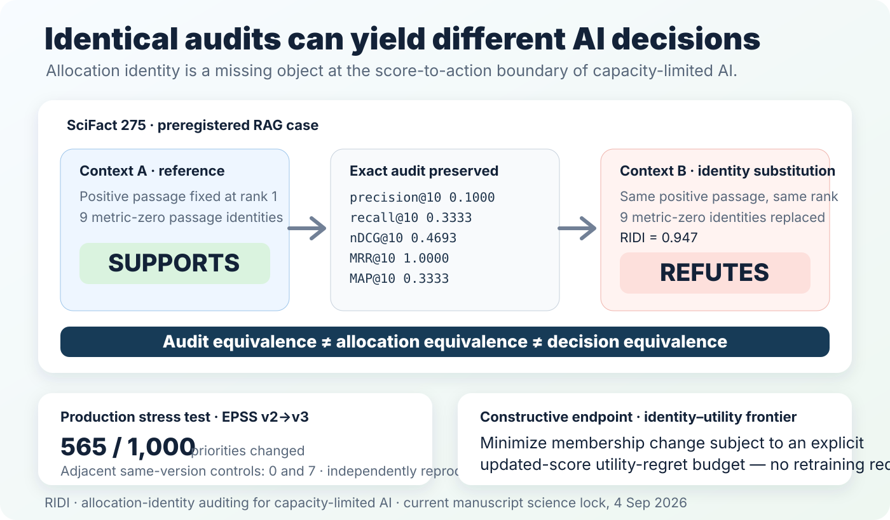

# RIDI

### Allocation identity for capacity-limited AI

> **See what aggregate evaluation can miss: who actually received the scarce slots.**

[](https://github.com/adeebnoor/ridi/actions/workflows/tests.yml)


<p align="center">
  
</p>

<p align="center">
  <a href="https://colab.research.google.com/github/adeebnoor/ridi/blob/main/notebooks/RIDI_60_Second_Experiment.ipynb"><b>Open in Colab</b></a> ·
  <a href="docs/QUICKSTART.md"><b>60-second Quick Start</b></a> ·
  <a href="docs/API.md"><b>Python API</b></a> ·
  <a href="docs/USE_CASES.md"><b>Use cases</b></a> ·
  <a href="docs/REPORTING_CHECKLIST.md"><b>Reporting checklist</b></a> ·
  <a href="paper/README.md"><b>Paper & evidence</b></a>
</p>

---

## The one-line idea

Performance, fairness, calibration and ranking metrics remain necessary. RIDI asks a different question at the **score-to-action boundary**:

> **Which identities occupy the finite queue, shortlist or context window—and did those identities change?**

Two systems can be exactly indistinguishable under a declared audit while assigning scarce slots to different identities. In the preregistered RAG experiment behind this project, that difference sometimes changed the downstream AI decision itself.

---

## Use it in seconds

### Already have two selected lists?

```python
from ridi_audit import compare_allocations

reference = ["doc-1", "doc-2", "doc-3", "doc-4"]
updated   = ["doc-1", "doc-2", "doc-9", "doc-4"]

report = compare_allocations(reference, updated)
print(report)
```

```text
RIDI Allocation Comparison
--------------------------
Before size:   4
After size:    4
Overlap:       3
Changed slots: 1
RIDI:          0.400000
```

This is the shortest path for **RAG contexts, shortlists, alert queues, remediation lists and other realized top-k allocations**.

### Have paired candidate scores?

```python
import pandas as pd
from ridi_audit import audit

before = pd.read_csv("before.csv")
after = pd.read_csv("after.csv")

report = audit(before, after, k=[10, 50, 100])
print(report)
```

Then bound avoidable turnover under an explicit utility-regret budget:

```python
controlled = report.control(k=100, eta=0.001)
```

### Install

Until the first PyPI publication is activated:

```bash
python -m pip install "git+https://github.com/adeebnoor/ridi.git"
ridi-audit demo
```

The repository is already configured for tokenless PyPI Trusted Publishing. After the one-time PyPI publisher binding, installation becomes:

```bash
pip install ridi-audit
```

---

## What makes RIDI useful

| You already report | RIDI adds |
|---|---|
| performance / accuracy | whether the identities receiving action changed |
| group fairness | realized membership change inside or across groups |
| rank correlation | finite top-k membership stability |
| retrieval quality | which passages actually entered the context window |
| model/version comparison | a direct allocation-level comparator |

For equal-size selected sets `A` and `B`:

```text
RIDI(A, B) = 1 - |A ∩ B| / |A ∪ B|
```

For equal-capacity top-`k`, the toolkit also reports **changed slots**. When paired score vectors are available it adds a sufficient score-margin stability certificate and the exact identity–utility frontier.

RIDI is **not** a replacement for AUROC, precision, recall, nDCG, calibration, robustness, safety or fairness. It makes realized membership observable.

---

## Evidence behind the project

| Test | Current result |
|---|---|
| **Preregistered RAG, 800 queries** | Exact registered retrieval-audit equivalence with **17.27%** benchmark-defined correctness divergence at the primary condition (95% CI **14.60–20.03%**) |
| **SciFact 275** | Same positive passage, rank and registered retrieval metrics; identity substitution changes **SUPPORTS → REFUTES**; order-only control remains SUPPORTS |
| **EPSS production update** | **565 / 1,000** priorities changed (`RIDI=0.722`) vs adjacent same-version controls of **0** and **7** |
| **Exact identity–utility frontier** | Separates necessary from avoidable turnover under an explicit utility-regret budget, with no retraining |

Most RAG benchmark-defined outcomes remained stable. The claim is **behavioral non-equivalence can exist inside an exactly audit-equivalent class**, not that every allocation change is harmful or that all AI systems are fragile.

### External verification status — 4 Sep 2026

- The sealed EPSS numerical workflow has been reproduced by **two independent external executors** in separate environments.
- A targeted blind external regeneration of SciFact 275 reproduced the substantive reference/permutation **SUPPORTS** versus identity-substitution **REFUTES** pattern on a distinct GPU/software stack.
- The regenerated reference prefixed its label with `Verdict:`, which the preregistered strict first-token parser marked unparseable; the raw discrepancy is retained transparently.
- These are independent computational executions, **not a CODECHECK certificate**. Community CODECHECK request #208 is registered; formal checking has not begun.

[Read the evidence and boundaries →](paper/README.md)

---

## Designed to drop into research workflows

**Framework-agnostic.** RIDI needs identities—and optionally scores—not a particular model library.

**Two entry points.** `compare_allocations()` for selected IDs; `audit()` for paired score tables.

**Publication-ready output.** Both researcher-facing reports can emit dictionaries or Markdown records.

**Control, not only measurement.** `AuditReport.control()` exposes the exact identity–utility frontier.

**Reproducible by default.** Deterministic tie handling, CI on Python 3.10–3.12, locked research workflows, negative results retained, and explicit verification boundaries.

### Common research settings

RAG and information retrieval · cybersecurity remediation · clinical alerts · fraud/compliance triage · inspection queues · hiring/shortlisting · grant review · moderation · any budget-constrained ranking or finite action set.

[Copy-paste recipes →](docs/USE_CASES.md)

---

## Use it in a paper

The [Allocation Identity Reporting Checklist](docs/REPORTING_CHECKLIST.md) gives a compact publication record covering capacity, selection rule, comparator, identity metrics, controls, conventional evaluation, privacy and downstream outcomes.

A minimal methods sentence is:

> We audited allocation identity at the prespecified capacity by reporting selected-set overlap, changed slots and RIDI alongside the domain’s conventional evaluation metrics.

Adapt it to the design; do not claim endpoints you did not test.

---

## Replicate it. Challenge it. Extend it.

Independent reproductions, boundary cases and null results are welcome. Use the dedicated GitHub issue forms for an **Independent replication** or a **New domain application** so the scientific design is visible from the first message.

A useful contribution can be a successful replication, a discrepancy, a domain where allocation identity matters, or a domain where it turns out to be redundant.

[Contributing guide →](CONTRIBUTING.md)

---

## Current manuscript

**Identical audits can yield different AI decisions**

The public repository is synchronized to the current science/product lock as of **4 Sep 2026**. The manuscript is prepared for journal submission; it is **not peer reviewed, accepted or published**.

Registered RxNorm and Open Targets failures remain part of the project record to delimit the claim. Allocation identity alone does not establish correctness, fairness, causal harm, benefit, clinical utility or model superiority.

- [Paper overview](paper/README.md)
- [RAG preregistration](https://osf.io/txwdv/)
- [Reproducibility guide](docs/REPRODUCIBILITY.md)
- [Numerical provenance](docs/NUMERICAL_PROVENANCE.md)
- [CODECHECK request #208](https://github.com/codecheckers/register/issues/208)

---

## Citation

If you use RIDI or `ridi-audit`, cite the software using [`CITATION.cff`](CITATION.cff) and the accompanying manuscript when a public bibliographic record is available.

**Adeeb Noor**  
Department of Information Technology, Faculty of Computing and Information Technology  
King Abdulaziz University, Jeddah, Saudi Arabia  
ORCID: 0000-0002-8251-1853
