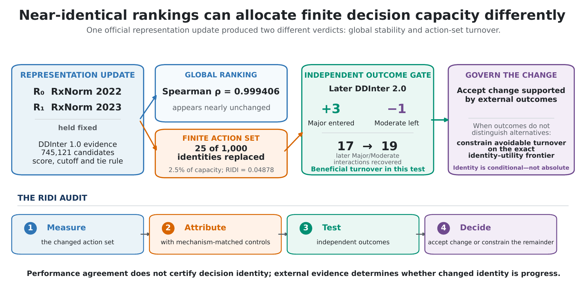

# RIDI

<div align="center">

## Decision identity is a controllable axis of reproducibility

**Measure what changed. Attribute why it changed. Test whether it helped. Constrain only the avoidable remainder.**

[](https://github.com/adeebnoor/ridi/actions/workflows/tests.yml)
[](https://www.python.org/)
[](LICENSE)
[](https://orcid.org/0000-0002-8251-1853)

</div>



Computational systems frequently allocate **finite decision capacity**: the 100 molecules sent to a laboratory, the 1,000 records assigned to reviewers, or the documents shown on the first page. Conventional metrics can remain almost unchanged while the identities occupying those scarce decision slots change.

RIDI makes that hidden turnover measurable and governable. It is a representation-aware audit protocol, a score-margin certificate, and an exact identity-constrained selector for top-*k* systems.

> Reproducing performance is not sufficient to reproduce a decision.

## The result in one view

| Question | Standard audit | RIDI audit |
|---|---|---|
| Did average performance remain stable? | AUROC, nDCG, MRR | Retained and reported |
| Did the ranking remain globally similar? | Spearman, Kendall | Retained and reported |
| Did the same identities receive scarce decision slots? | Usually unmeasured | **RIDI + changed slots** |
| Can zero turnover be guaranteed? | Usually no | **Score-margin certificate** |
| Is the change larger than retraining noise? | Often unclear | **Same-representation null** |
| Can avoidable turnover be constrained? | Heuristic | **Exact identity–utility frontier** |

In the manuscript's locked analyses:

- an official RxNorm representation update produced **Spearman ρ = 0.999406**, yet replaced **25 of 1,000** decision identities (RIDI = 0.04878);
- independent later evidence recovered 17 → 19 Major/Moderate interactions, showing that turnover can be beneficial and should not be suppressed blindly;
- **33,958 of 168,000** synthetic cases were certified stable with **zero false certificates**;
- at a 0.1% utility-regret tolerance, **78.8%** of representation-associated GraphSAGE turnover and **28.7%** of text-retrieval turnover was avoidable.

The drug examples are operational illustrations of selection movement, not claims of clinical benefit, risk, or prescribing guidance.

## Install

```bash
git clone https://github.com/adeebnoor/ridi.git
cd ridi
python -m pip install .
```

Development installation:

```bash
python -m pip install -e ".[dev]"
pytest -q
```

## Run a decision-identity audit

Prepare two CSV files with the same candidate IDs and one score per candidate:

```bash
ridi-audit compare \
  --r0 examples/r0.csv \
  --r1 examples/r1.csv \
  --id-col id \
  --score-col score \
  --k 3 5 \
  --out audit.json \
  --report audit.md
```

The report contains global Spearman agreement, RIDI, changed decision slots, overlap, the top-*k* margin `gamma_k`, paired perturbation `epsilon`, and the sufficient zero-turnover certificate `gamma_k > 2*epsilon`.

## Constrain avoidable turnover exactly

```bash
ridi-audit control \
  --r0 examples/r0.csv \
  --r1 examples/r1.csv \
  --id-col id \
  --score-col score \
  --k 5 \
  --eta 0.001 \
  --out controlled.json
```

For a declared utility-regret tolerance `eta`, the selector returns the feasible top-*k* set with the **fewest identity changes**. Sorting dominates the computation, so the exact frontier is evaluated in `O(n log n)` time. The default demonstration tolerance `eta = 0.001` means at most 0.1% normalized score-utility regret; deployments should set `eta` prospectively from domain costs and governance requirements.

## The four-step RIDI protocol

1. **Measure** decision-set turnover under a declared representation intervention.
2. **Attribute** it using mechanism-matched invariance controls and, for learned systems, a retraining null.
3. **Test** changed identities against independent outcomes when such evidence exists.
4. **Decide** whether to accept supported change or constrain the avoidable remainder on the exact identity–utility frontier.

See the [minimum reporting standard](RIDI_AUDIT_MINIMUM_REPORTING_STANDARD_v1.md), [methods note](docs/METHODS.md), and [reproducibility guide](docs/REPRODUCIBILITY.md).

## Core definitions

For top-*k* decision sets `A` and `B`:

```text
RIDI(A, B) = 1 - |A ∩ B| / |A ∪ B|
```

`RIDI = 0` means identical decision identities; `RIDI = 1` means disjoint sets. RIDI is deliberately reported beside—not instead of—task performance and global rank agreement.

For baseline top-*k* margin `gamma_k` and maximum paired score perturbation `epsilon`:

```text
gamma_k > 2*epsilon  =>  identical top-k decision identity
```

This is a sufficient, one-sided certificate. Failure to certify does not imply instability. Once paired scores are stored, certification needs no retraining or additional inference.

## Scientific scope

RIDI measures turnover, not correctness, fairness, causal benefit, or harm. A non-zero audit result supports attribution to representation only when source evidence, inference, candidates, decision rules, and randomness are controlled as declared. The repository preserves adverse and boundary results because a failed gate defines where attribution or utility retention does not hold.

## Repository map

```text
src/ridi_audit/        Metric, certificate, exact selector and CLI
tests/                 Unit and brute-force optimality tests
examples/              Minimal aligned score tables
docs/                  Methods, interpretation and reproduction guidance
.github/workflows/     Continuous integration
```

Large confirmatory artifacts, locked protocols, source data and manuscript figures are archived separately under the project DOI. The DOI `10.5281/zenodo.22072275` has been reserved and will be changed here to an active archival link immediately after the public record is published.

## Citation

Until the manuscript receives its final bibliographic record, cite the software using [`CITATION.cff`](CITATION.cff):

> Noor, A. (2026). *RIDI: Decision-identity reproducibility audit* (v1.0.0). GitHub. https://github.com/adeebnoor/ridi

## Author

**Adeeb Noor**  
Department of Information Technology, Faculty of Computing and Information Technology, King Abdulaziz University, Jeddah, Saudi Arabia  
[ORCID](https://orcid.org/0000-0002-8251-1853)

## Status

Version 1.0.0 is the public software companion to a manuscript prepared for journal submission. The manuscript is not yet peer reviewed. Please use the issue tracker for reproducible bug reports and methodological questions.

