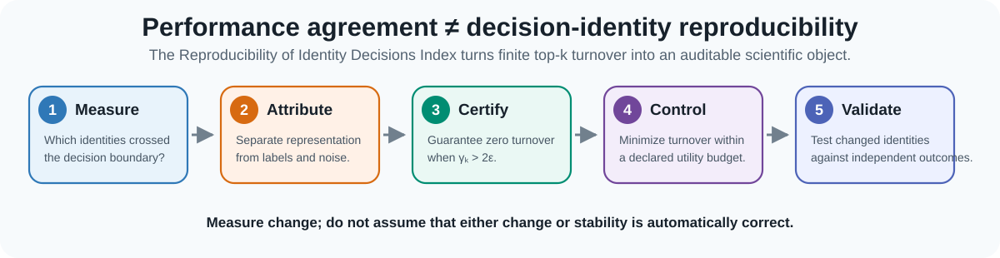

# RIDI

<div align="center">

## Reproducibility of Identity Decisions Index

## Reproducible performance does not guarantee reproducible decisions

**A small metric, a falsifiable experiment, and an exact control algorithm for systems that select a finite top-*k*.**

[](https://github.com/adeebnoor/ridi/actions/workflows/tests.yml)
[](https://www.python.org/)
[](LICENSE)
[](https://orcid.org/0000-0002-8251-1853)

[**Try the interactive experiment**](https://htmlpreview.github.io/?https://github.com/adeebnoor/ridi/blob/main/demo/index.html) · [**Run in Colab**](https://colab.research.google.com/github/adeebnoor/ridi/blob/main/notebooks/RIDI_60_Second_Experiment.ipynb) · [**Install the toolkit**](#install)

</div>

---



## What is RIDI?

The **Reproducibility of Identity Decisions Index (RIDI)** measures whether two versions of a computational system allocate the same finite decision capacity to the same identities.

Suppose two versions of a system each select 100 candidates for human review.

- If both versions select exactly the same 100 identities, **RIDI = 0**.
- If they share 75 identities, 25 seats were replaced and **RIDI = 0.40**.
- If they share no identities, **RIDI = 1**.

RIDI is simply the Jaccard distance between two finite decision sets:

```text
RIDI(A, B) = 1 - |A ∩ B| / |A ∪ B|
```

It answers one operational question:

> **Did the same candidates receive the scarce decision slots?**

RIDI does not replace AUROC, nDCG, MRR, Spearman correlation, fairness evaluation, or domain validation. It reports a different axis that those measures do not certify: **decision identity**.

## The scientific contribution

The scalar is intentionally simple: its set-distance primitive is Jaccard distance. The contribution is the surrounding reproducibility framework that turns finite decision identity into a falsifiable and controllable scientific object:

1. isolate a representation intervention while freezing or calibrating other causes of change;
2. measure the identities that cross a declared decision boundary;
3. certify zero turnover when a score-margin condition holds;
4. compute the exact minimum-turnover solution within a declared utility tolerance; and
5. test changed identities against independent outcomes rather than assuming that stability is always desirable.

This separates three questions that aggregate performance alone cannot answer: **what changed, what caused it, and how much of it was necessary?**

## The 60-second experiment

Can two rankings be almost identical globally while selecting completely different candidates?

```bash
python examples/identity_paradox.py
```

Expected result:

```text
Candidates (n):               10,000
Decision capacity (k):            50
Global Spearman agreement:  0.999998500
Top-k overlap:                     0 / 50
RIDI:                          1.000

Verdict: near-perfect global agreement, completely different decisions.
```

The experiment is deterministic. It swaps only two adjacent blocks of 50 ranks in a universe of 10,000. The global disturbance is tiny, but every finite decision seat changes.

For this construction:

```text
Spearman rho = 1 - 12*k^3 / (n*(n^2 - 1))
RIDI         = 1
```

As `n` grows, Spearman approaches 1 while the selected sets remain disjoint. Therefore, **no threshold on global rank agreement alone can guarantee top-*k* identity**.

<div align="center">

[](https://htmlpreview.github.io/?https://github.com/adeebnoor/ridi/blob/main/demo/index.html)
[](https://colab.research.google.com/github/adeebnoor/ridi/blob/main/notebooks/RIDI_60_Second_Experiment.ipynb)

</div>

The browser experiment runs locally in the page, uploads no data, and lets you change the candidate universe, decision capacity, and number of replaced seats.

## From observation to action

RIDI is not only a distance. The research framework defines a five-part audit; the public toolkit directly implements measurement, certification and exact control, and supplies the reporting structure for attribution and outcome validation.

| Step | Question | Output |
|---|---|---|
| **Measure** | Which finite decision identities changed? | RIDI, changed slots, overlap |
| **Attribute** | Was the change caused by representation rather than relabelling or retraining noise? | Invariance controls and retraining null |
| **Certify** | Can zero turnover be guaranteed from stored scores? | `gamma_k > 2*epsilon` certificate |
| **Control** | How much turnover is actually needed to preserve updated utility? | Exact identity–utility frontier |
| **Validate** | Did changed identities improve an independently assessed outcome? | Pre-specified outcome gate, including adverse results |

The exact selector finds the minimum-turnover top-*k* set within a prospectively declared utility-regret tolerance. Sorting dominates the calculation, giving `O(n log n)` complexity.

## Evidence at a glance

The locked manuscript analyses provide five complementary tests of the framework:

- **Mathematical separation:** global Spearman agreement can approach one while top-*k* decision sets remain disjoint.
- **Certification:** `33,958` of `168,000` synthetic cases were certified with zero false certificates.
- **Attribution:** GraphSAGE representation AURIDI was `0.11571` versus a same-representation retraining null of `0.08052`—a `44%` relative excess; the absolute difference was `0.03519` (95% query-bootstrap interval `0.02184–0.05119`) while AUROC was `0.91772` versus `0.91747`.
- **Exact control:** at the demonstration tolerance `eta = 0.001`, `78.8%` of GraphSAGE turnover and `28.7%` of text-retrieval turnover was avoidable under the declared utility.
- **Independent outcome boundary:** an RxNorm update changed `25` of `1,000` selected identities despite Spearman `0.999406`; later DDInter curation increased recovered interactions from `17` to `19`, whereas exact zero-change control returned `17` and failed the pre-specified `97.5%` retention gate.

These results establish measurement, attribution, certification and controllability. They do **not** establish clinical harm, patient benefit or universal turnover rates. See [results and interpretation boundaries](docs/RESULTS_AT_A_GLANCE.md) and [numerical provenance](docs/NUMERICAL_PROVENANCE.md).

## Install

```bash
git clone https://github.com/adeebnoor/ridi.git
cd ridi
python -m pip install .
```

Verify the installation:

```bash
ridi-audit --version
pytest -q
```

## Audit your own scores

Prepare two CSV files containing the same candidate IDs and one score per candidate:

```bash
ridi-audit compare \
  --r0 examples/r0.csv \
  --r1 examples/r1.csv \
  --id-col id \
  --score-col score \
  --k 3 5 \
  --out audit.json \
  --report audit.md
```

The report contains:

- global Spearman agreement;
- RIDI, changed slots and overlap at each cutoff;
- the baseline boundary margin `gamma_k`;
- maximum paired score perturbation `epsilon`; and
- whether `gamma_k > 2*epsilon` certifies identical top-*k* identity.

The certificate is sufficient and one-sided. A failed certificate does not imply turnover. Once paired scores are stored, certification needs no retraining or additional inference.

## Control avoidable turnover

```bash
ridi-audit control \
  --r0 examples/r0.csv \
  --r1 examples/r1.csv \
  --id-col id \
  --score-col score \
  --k 5 \
  --eta 0.001 \
  --out controlled.json
```

`eta = 0.001` allows at most 0.1% normalized updated-score utility regret. This is a demonstration choice, not a universal standard. Real deployments should declare the tolerance prospectively from domain costs, review capacity, safety requirements, and governance policy.

## Why this matters

A system rarely acts on an entire ranking. It allocates finite attention: molecules sent to a laboratory, records assigned to reviewers, patients flagged for follow-up, or documents shown on the first page. Global performance can be stable even when those identities change.

The accompanying locked analyses span drug-interaction knowledge, graph learning and text retrieval. They show three distinct possibilities:

1. turnover can be **hidden** by global agreement;
2. turnover can be **beneficial**, so stability must not be enforced blindly; and
3. when outcomes do not justify alternatives, part of the turnover can be **avoided exactly** within a declared utility budget.

The full empirical record belongs in the manuscript and immutable archive. This repository is deliberately organized around understanding, testing and reusing the method.

## Scientific boundaries

RIDI measures turnover—not correctness, fairness, clinical benefit, causal harm, or model superiority. Representation attribution requires source evidence, inference, candidate universe, decision rules and randomness to be frozen or explicitly controlled. Drug examples in the research archive are operational selection illustrations, not prescribing guidance.

## Repository map

```text
demo/                   Zero-install browser experiment
notebooks/              One-click Colab experiment
examples/               Minimal scripts and aligned score tables
src/ridi_audit/         Metric, certificate, exact selector and CLI
tests/                  Unit and brute-force optimality tests
docs/                   Methods, interpretation and reproduction guidance
.github/workflows/      Continuous integration
```

Start with the [interactive experiment](https://htmlpreview.github.io/?https://github.com/adeebnoor/ridi/blob/main/demo/index.html), then read the [methods note](docs/METHODS.md) and [minimum reporting standard](RIDI_AUDIT_MINIMUM_REPORTING_STANDARD_v1.md).

## Citation and archive

Use [`CITATION.cff`](CITATION.cff) to cite the software:

> Noor, A. (2026). *RIDI (Reproducibility of Identity Decisions Index): decision-identity reproducibility audit* (v1.0.0). GitHub. https://github.com/adeebnoor/ridi

The archival DOI `10.5281/zenodo.22072275` is reserved and will become the citation target when its public record is activated.

## Author

**Adeeb Noor**  
Department of Information Technology, Faculty of Computing and Information Technology, King Abdulaziz University, Jeddah, Saudi Arabia  
[ORCID](https://orcid.org/0000-0002-8251-1853)

## Status

Version 1.0.0 is the public software companion to the v20 manuscript **prepared for submission to Nature**. It has not been submitted, accepted or peer reviewed.
